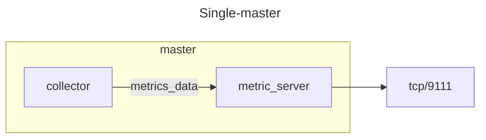
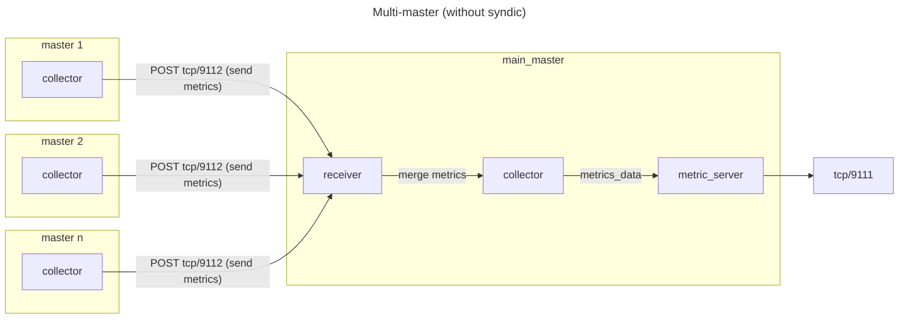
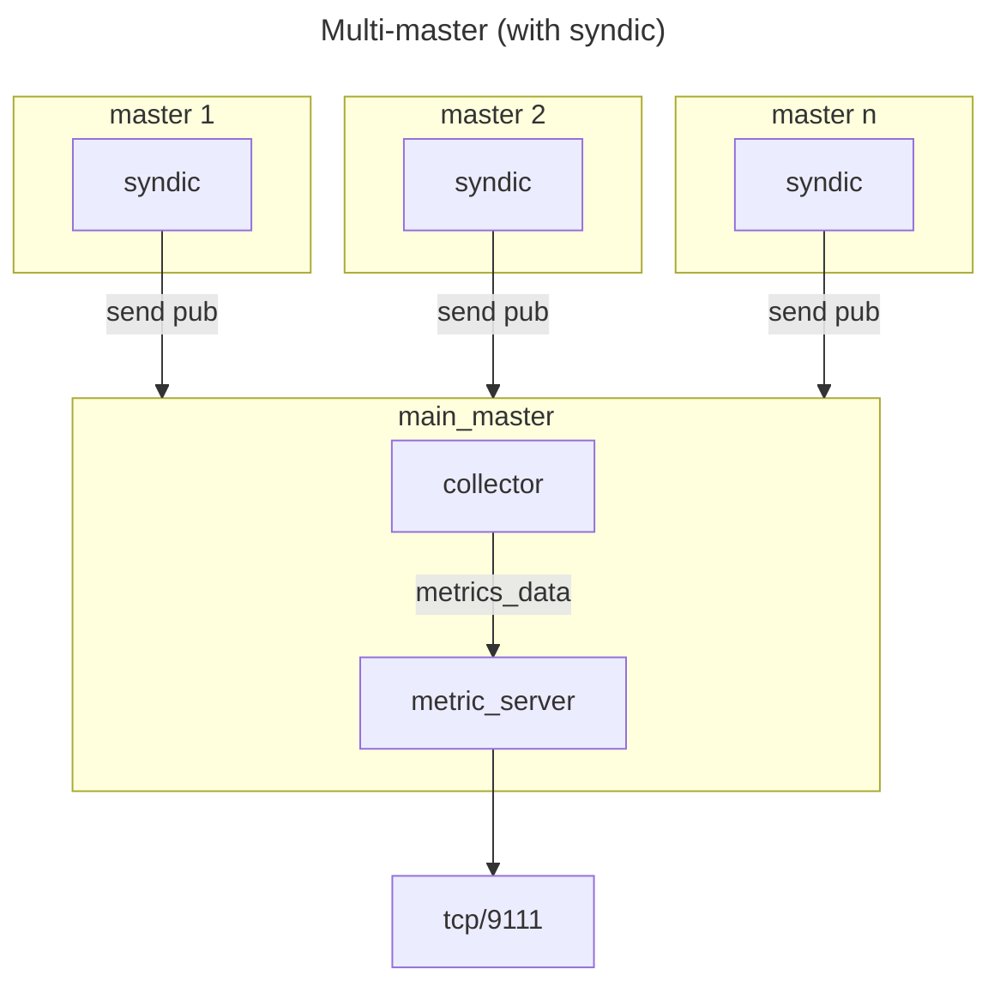

# SaltStack Metrics Exporter

This exporter scraping data from salt-masters.

## Available Metrics

- `salt_all_jobs_total` - Total jobs count.
- `salt_active_jobs_total` - Total active jobs count.
- `salt_minions_up_total` - Total up minions count.
- `salt_minions_down_total` - Total down minions count.
- `salt_minions_total` - Total minions count.
- `salt_minion_job_duration_seconds` - Duration of Salt jobs in seconds.
- `salt_minion_job_retcode` - Retcode of Salt job.
- `salt_minion_status` - Status of salt-minion (0 - offline, 1 - online).
- `salt_accepted_minions_total` - Total accepted minions count.
- `salt_denied_minions_total` - Total denied minions count.
- `salt_rejected_minions_total` - Total rejected minions count.
- `salt_unaccepted_minions_total` - Total unaccepted minions count.

## Arch

⚠️ **Multi-master mode should only be used if there is no syndic configured on the masters, if there are syndics, then the exporter must be deployed only on the main master like in a single master mode.**

## Documentation

- [`English`](./docs/EN.md)

- [`Russian`](./docs/RU.md)

## Changelogs

- [1.x](./changelogs/1.x.md)
