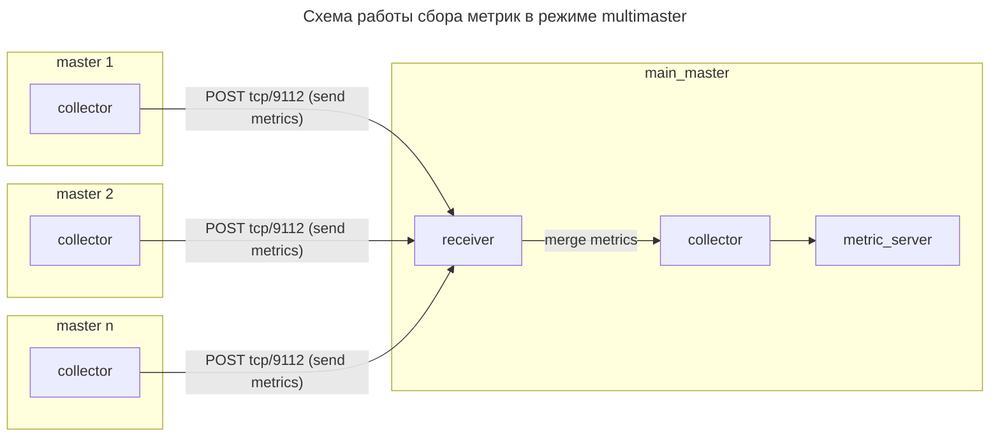

# SaltStack Metrics Exporter

This exporter scraping data from salt-masters.

## Metrics

- `salt_all_jobs_total` - Total jobs count.
- `salt_active_jobs_total` - Total active jobs count.
- `salt_minions_up_total` - Total up minions count.
- `salt_minions_down_total` - Total down minions count.
- `salt_minions_total` - Total minions count.
- `salt_minion_job_duration_seconds` - Duration of Salt jobs in seconds.
- `salt_minion_job_retcode` - Retcode of Salt job.
- `salt_minion_status` - Status of salt-minion (0 - offline, 1 - online).
- `salt_accepted_minions_total` - Total accepted minions count.
- `salt_denied_minions_total` - Total denied minions count.
- `salt_rejected_minions_total` - Total rejected minions count.
- `salt_unaccepted_minions_total` - Total unaccepted minions count.

## Arch



## Install

1. Copy repo via:

```bash
git clone git@github.com:JoePeach88/salt-exporter.git
```

2. Prepare folder structure on target salt-master, this should be something like:

```text
opt
└──saltstack
   └── exporters
       ├   modules
       ├   └── salt_master_local_client.py
       └── master_exporter
           ├── env.py
           ├── exporter
           └── exporter.py
```

3. Check that required ports are opened on firewall, for default configuration it\`s: `9111`

4. Install requirements via pip:

```bash
/opt/saltstack/salt/bin/python3 -m pip install -r /path/to/requirements.txt
```

5. Copy unit file from downloaded repo to: `/etc/systemd/system/salt-master-exporter.service`

6. Reload daemon, enable and start unit:

```bash
systemctl daemon-reload && systemctl enable --now salt-master-exporter.service
```


## Configuration

1. Go to config file: `/opt/saltstack/exporters/master_exporter/exporter`

2. Edit configuration:

```ini
[main]
addr=
port=
collect_delay=
debug=
exclude_jobs=
```

- `addr` - The address where the server will operate (default: `0.0.0.0`).

- `port` - The port where the server will operate (default: `9111`).

- `collect_delay` - The delay between metrics updates (default: `300`).

- `debug` - Launch exporter in debug mode (default: `False`).

- `exclude_jobs` - Which jobs excluded from parse in duration and retcode.


## Preview

When open page with metrics (via `curl` or something else), you`ll see output like this:

```text
...
# HELP salt_all_jobs_total Total jobs count for current date.
# TYPE salt_all_jobs_total gauge
salt_all_jobs_total 5594.0
# HELP salt_active_jobs_total Total active jobs count.
# TYPE salt_active_jobs_total gauge
salt_active_jobs_total 0.0
# HELP salt_minions_up_total Total up minions count.
# TYPE salt_minions_up_total gauge
salt_minions_up_total 5.0
# HELP salt_minions_down_total Total down minions count.
# TYPE salt_minions_down_total gauge
salt_minions_down_total 0.0
# HELP salt_minions_total Total minions count.
# TYPE salt_minions_total gauge
salt_minions_total 5.0
# HELP salt_accepted_minions_total Total accepted minions count.
# TYPE salt_accepted_minions_total gauge
salt_accepted_minions_total 5.0
# HELP salt_denied_minions_total Total denied minions count.
# TYPE salt_denied_minions_total gauge
salt_denied_minions_total 1.0
# HELP salt_rejected_minions_total Total rejected minions count.
# TYPE salt_rejected_minions_total gauge
salt_rejected_minions_total 0.0
# HELP salt_unaccepted_minions_total Total unaccepted minions count.
# TYPE salt_unaccepted_minions_total gauge
salt_unaccepted_minions_total 0.0
# HELP salt_minion_job_duration_seconds Duration of Salt jobs in seconds.
# TYPE salt_minion_job_duration_seconds summary
salt_minion_job_duration_seconds_count{fun="state.apply",jid="20250818192218268558",minion="minion_id"} 1.0
salt_minion_job_duration_seconds_sum{fun="state.apply",jid="20250818192218268558",minion="minion_id"} 2385.976
salt_minion_job_duration_seconds_count{fun="saltutil.find_job",jid="20250818175831693544",minion="minion_id"} 1.0
salt_minion_job_duration_seconds_sum{fun="saltutil.find_job",jid="20250818175831693544",minion="minion_id"} 0.0
salt_minion_job_duration_seconds_count{fun="saltutil.find_job",jid="20250818180924772900",minion="minion_id"} 1.0
salt_minion_job_duration_seconds_sum{fun="saltutil.find_job",jid="20250818180924772900",minion="minion_id"} 0.0
salt_minion_job_duration_seconds_count{fun="state.highstate",jid="20250818191522649138",minion="minion_id"} 1.0
salt_minion_job_duration_seconds_sum{fun="state.highstate",jid="20250818191522649138",minion="minion_id"} 0.0
salt_minion_job_duration_seconds_count{fun="state.highstate",jid="20250818185134432987",minion="minion_id"} 1.0
salt_minion_job_duration_seconds_sum{fun="state.highstate",jid="20250818185134432987",minion="minion_id"} 0.0
# HELP salt_minion_job_duration_seconds_created Duration of Salt jobs in seconds.
# TYPE salt_minion_job_duration_seconds_created gauge
salt_minion_job_duration_seconds_created{fun="state.apply",jid="20250818192218268558",minion="minion_id"} 1.7555450312654586e+09
salt_minion_job_duration_seconds_created{fun="saltutil.find_job",jid="20250818175831693544",minion="minion_id"} 1.755545031265483e+09
salt_minion_job_duration_seconds_created{fun="saltutil.find_job",jid="20250818180924772900",minion="minion_id"} 1.755545031265498e+09
salt_minion_job_duration_seconds_created{fun="state.highstate",jid="20250818191522649138",minion="minion_id"} 1.7555450312655108e+09
salt_minion_job_duration_seconds_created{fun="state.highstate",jid="20250818185134432987",minion="minion_id"} 1.7555450312655237e+09
# HELP salt_minion_job_retcode Retcode of Salt job.
# TYPE salt_minion_job_retcode gauge
salt_minion_job_retcode{fun="state.apply",minion="minion_id"} 0.0
salt_minion_job_retcode{fun="saltutil.find_job",minion="minion_id"} 0.0
salt_minion_job_retcode{fun="saltutil.find_job",minion="minion_id"} 0.0
salt_minion_job_retcode{fun="state.highstate",minion="minion_id"} 1.0
salt_minion_job_retcode{fun="state.highstate",minion="minion_id"} 1.0
# HELP salt_minion_status Status of salt-minion (0 - offline, 1 - online).
# TYPE salt_minion_status gauge
salt_minion_status{minion="minion_id"} 1.0
salt_minion_status{minion="minion_id"} 1.0
salt_minion_status{minion="minion_id"} 1.0
salt_minion_status{minion="minion_id"} 1.0
salt_minion_status{minion="minion_id"} 1.0
...
```