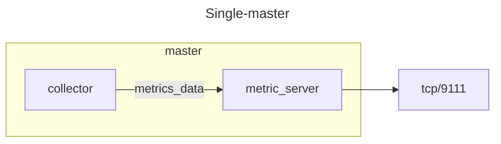
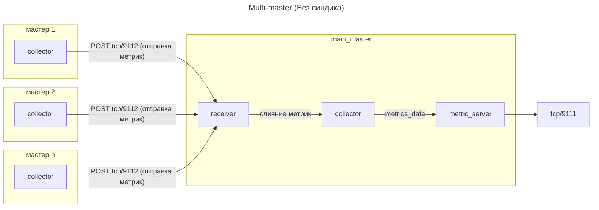

# SaltStack Metrics Exporter

Этот экспортер собирает данные с salt-мастеров.

## Метрики

- `salt_all_jobs_total` - Общее количество задач.
- `salt_active_jobs_total` - Общее количество активных задач.
- `salt_minions_up_total` - Общее количество поднятых миньонов.
- `salt_minions_down_total` - Общее количество опущенных миньонов.
- `salt_minions_total` - Общее количество миньонов.
- `salt_minion_job_duration_seconds` - Длительность задач Salt в секундах.
- `salt_minion_job_retcode` - Код возврата задачи Salt.
- `salt_minion_status` - Статус salt-minion (0 - офлайн, 1 - онлайн).
- `salt_accepted_minions_total` - Общее количество принятых миньонов.
- `salt_denied_minions_total` - Общее количество отклонённых миньонов.
- `salt_rejected_minions_total` - Общее количество отвергнутых миньонов.
- `salt_unaccepted_minions_total` - Общее количество неподтверждённых миньонов.

## Архитектура





⚠️ **Режим multi-master необходимо использовать только в том случае, если на мастерах не настроен синдик, в случае же если синдики есть, то необходимо развернуть экспортер только на главном мастере**

## Установка

1. Склонируйте репозиторий командой:

```bash
git clone git@github.com:JoePeach88/salt-exporter.git
```


2. Подготовьте структуру папок на целевом salt-мастере, она должна выглядеть примерно так:

```text
opt
└──saltstack
   └── exporters
       ├   modules
       ├   └── salt_master_local_client.py
       └── master_exporter
           ├── env.py
           ├── exporter
           └── exporter.py
```


3. Проверьте, что необходимые порты открыты в брандмауэре, для конфигурации по-умолчанию это: `9111`.

4. Установите зависимости через pip:

```bash
/opt/saltstack/salt/bin/python3 -m pip install -r /path/to/requirements.txt
```


5. Скопируйте unit-файл из скачанного репозитория в: `/etc/systemd/system/salt-master-exporter.service`

6. Перезагрузите демон systemd, включите и запустите сервис:

```bash
systemctl daemon-reload & systemctl enable --now salt-master-exporter.service
```

## Конфигурация

1. Откройте конфигурационный файл: `/opt/saltstack/exporters/master_exporter/exporter`

2. Отредактируйте настройки:

```ini
[main]
addr=
collect_delay=
port=
rport=
main_master=
main_master_addr=
multimaster_mode=
debug=
exclude_jobs=
include_jobs=
```

- `addr` — Адрес, на котором будет работать сервер (по умолчанию: 0.0.0.0).

- `collect_delay` — Задержка между обновлениями метрик (по умолчанию: 300).

- `port` — Порт, на котором будет работать сервер (по умолчанию: 9111).

- `rport` — Порт, на котором будет работать сервер-приёмник (по умолчанию: 9112).

- `main_master` — Указывает, является ли этот сервер, на котором запущен экспортер, главным мастером (по умолчанию: True).

- `main_master_addr` — Адрес главного мастера.

- `multimaster_mode` — Включает режим мультимастера для экспортера (по умолчанию: False).

- `debug` — Запуск экспортера в режиме отладки (по умолчанию: False).

- `exclude_jobs` — Задачи, исключённые из парсинга по длительности и коду возврата (поддерживает regex).

- `include_jobs` — Задачи, включенные в парсинг по длительности и коду возврата (поддерживает regex).

### Конфигурация для одного мастера/нескольких мастеров с синдиком

```ini
[main]
addr=0.0.0.0
collect_delay=300
port=9111
rport=9112
main_master=True
main_master_addr=localhost
multimaster_mode=False
debug=False
exclude_jobs=
include_jobs=^state\..*
```

### Конфигурация для нескольких мастеров (без синдика)

**Основной мастер:**

```ini
[main]
addr=0.0.0.0
collect_delay=300
port=9111
rport=9112
main_master=True
main_master_addr=prod-main-salt-master.local.domain
multimaster_mode=True
debug=False
exclude_jobs=
include_jobs=^state\..*
```

**Остальные мастера:**

```ini
[main]
addr=0.0.0.0
collect_delay=300
port=9111
rport=9112
main_master=False
main_master_addr=prod-main-salt-master.local.domain
multimaster_mode=True
debug=False
exclude_jobs=
include_jobs=^state\..*
```

## Просмотр

При открытии страницы с метриками (через curl или другим способом) вы увидите вывод примерно такого вида:

```text
...
# HELP salt_all_jobs_total Total jobs count for current date.
# TYPE salt_all_jobs_total gauge
salt_all_jobs_total 1365.0
# HELP salt_active_jobs_total Total active jobs count.
# TYPE salt_active_jobs_total gauge
salt_active_jobs_total 0.0
# HELP salt_minions_up_total Total up minions count.
# TYPE salt_minions_up_total gauge
salt_minions_up_total 3.0
# HELP salt_minions_down_total Total down minions count.
# TYPE salt_minions_down_total gauge
salt_minions_down_total 2.0
# HELP salt_minions_total Total minions count.
# TYPE salt_minions_total gauge
salt_minions_total 6.0
# HELP salt_accepted_minions_total Total accepted minions count.
# TYPE salt_accepted_minions_total gauge
salt_accepted_minions_total 5.0
# HELP salt_denied_minions_total Total denied minions count.
# TYPE salt_denied_minions_total gauge
salt_denied_minions_total 1.0
# HELP salt_rejected_minions_total Total rejected minions count.
# TYPE salt_rejected_minions_total gauge
salt_rejected_minions_total 0.0
# HELP salt_unaccepted_minions_total Total unaccepted minions count.
# TYPE salt_unaccepted_minions_total gauge
salt_unaccepted_minions_total 0.0
# HELP salt_minion_job_duration_seconds Duration of Salt jobs in seconds.
# TYPE salt_minion_job_duration_seconds gauge
salt_minion_job_duration_seconds{fun="state.apply",jid="20250908133244084128",master="master1",minion="minion1"} 2.022126
salt_minion_job_duration_seconds{fun="state.apply",jid="20250908133245525956",master="master1",minion="minion2"} 2.4806880000000002
salt_minion_job_duration_seconds{fun="state.highstate",jid="20250908135216842648",master="master2",minion="minion3"} 0.0
salt_minion_job_duration_seconds{fun="state.apply",jid="20250908132918050527",master="master2",minion="minion4"} 1.9179059999999999
salt_minion_job_duration_seconds{fun="saltutil.refresh_pillar",jid="20250908135703802637",master="master2",minion="minion5"} 0.0
# HELP salt_minion_job_retcode Retcode of Salt job.
# TYPE salt_minion_job_retcode gauge
salt_minion_job_retcode{fun="state.apply",master="master1",minion="minion1"} 1.0
salt_minion_job_retcode{fun="state.apply",master="master1",minion="minion2"} 1.0
salt_minion_job_retcode{fun="state.highstate",master="master2",minion="minion3"} 1.0
salt_minion_job_retcode{fun="state.apply",master="master2",minion="minion4"} 0.0
salt_minion_job_retcode{fun="saltutil.refresh_pillar",master="master2",minion="minion5"} 0.0
# HELP salt_minion_status Status of salt-minion (0 - offline, 1 - online).
# TYPE salt_minion_status gauge
salt_minion_status{minion="minion1"} 0.0
salt_minion_status{minion="minion2"} 0.0
salt_minion_status{minion="minion3"} 1.0
salt_minion_status{minion="minion4"} 1.0
salt_minion_status{minion="minion5"} 1.0
...
```
